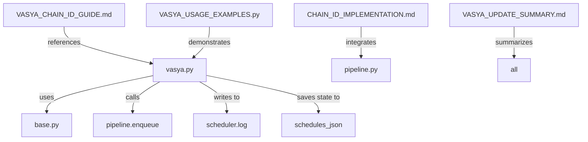

# Manifest: Vasya Chain ID Implementation

## Files Overview

### Modified Production Files

#### `vasya.py` (↑180 lines)
**Path**: `e:\MILA GOLD\mila-office\vasya.py`

**Changes**:
- Added chain_id tracking infrastructure (state management, logging)
- Updated `schedule_post()` to require `chain_id` parameter
- Added `post_type` optional parameter
- Implemented automatic validation and error logging
- Added helper functions: `get_scheduling_logs()`, `list_chain_states()`
- Updated system prompt to include chain_id guidance
- Added `/логи` quick command
- Persists scheduling state to `reports/schedules/<chain_id>.json`

**Key additions**:
```python
_new_chain_id(prefix="vasya")  # Generate unique chain ID
_load_chain_state(chain_id)    # Load checkpoint
_save_chain_state(chain_id, state)  # Persist checkpoint
_log_scheduling_decision(...)  # Log all scheduling decisions
schedule_post(..., chain_id, post_type="photo")  # Updated API
```

**Status**: ✓ Syntax checked, ready for use

---

### Documentation Files (New)

#### 1. `VASYA_CHAIN_ID_GUIDE.md`
**Path**: `e:\MILA GOLD\mila-office\VASYA_CHAIN_ID_GUIDE.md`

**Purpose**: Complete user guide for chain_id tracking

**Contents**:
- Overview & benefits (traceability, rollback, error recovery)
- How it works (chain ID generation, scheduling, decision logging)
- 3 detailed scenarios (weekly schedule, partial failure, reschedule)
- Debugging guide (view logs, list chains, load state)
- Integration with pipeline.py
- API reference with all functions
- FAQ section
- Example: weekly schedule workflow

**Audience**: Developers integrating chain_id into agent prompts

---

#### 2. `CHAIN_ID_IMPLEMENTATION.md`
**Path**: `e:\MILA GOLD\mila-office\CHAIN_ID_IMPLEMENTATION.md`

**Purpose**: Integration checklist for pipeline.py

**Contents**:
- Summary of Vasya changes (completed)
- Required changes to pipeline.py (step-by-step)
- New queue schema with chain_id
- Query functions to add (get_chain_posts, cancel_chain, reschedule_chain)
- Logging integration for pipeline operations
- End-to-end usage flow
- Backward compatibility notes
- Monitoring & debugging queries
- Implementation checklist (4/10 completed)

**Audience**: Developer updating pipeline.py

---

#### 3. `VASYA_USAGE_EXAMPLES.py`
**Path**: `e:\MILA GOLD\mila-office\VASYA_USAGE_EXAMPLES.py`

**Purpose**: Runnable code examples for chain_id usage

**Contents**: 6 practical examples
1. **Create weekly schedule** — 5 posts with single chain_id
2. **Handle errors** — Missing media URL, partial failure
3. **Reschedule chain** — Move all posts 1 hour earlier
4. **View logs** — Show recent decisions
5. **Analyze chain** — Detailed state breakdown
6. **Decision tree** — Show scheduling logic

**Audience**: Developers learning the API, testing implementation

**Usage**:
```bash
cd e:\MILA GOLD\mila-office
python VASYA_USAGE_EXAMPLES.py
```

---

#### 4. `VASYA_UPDATE_SUMMARY.md` (This Document)
**Path**: `e:\MILA GOLD\mila-office\VASYA_UPDATE_SUMMARY.md`

**Purpose**: High-level summary for stakeholders

**Contents**:
- Overview & key changes
- File changes (modified, new)
- How it works (workflow diagram)
- Backward compatibility
- Integration needs
- Key features with examples
- Logging format & state file format
- Testing instructions
- Next steps
- API quick reference

**Audience**: Project lead, all developers

---

#### 5. `MANIFEST_VASYA_CHAIN_ID.md`
**Path**: `e:\MILA GOLD\mila-office\MANIFEST_VASYA_CHAIN_ID.md`

**Purpose**: This file — comprehensive file index

**Contents**:
- File overview with descriptions
- Paths and purposes
- Quick links & dependencies
- Directory structure
- File relationships

**Audience**: Anyone needing to navigate the implementation

---

## Directory Structure

```
e:\MILA GOLD\mila-office\
├── vasya.py                        (MODIFIED - chain_id tracking)
├── VASYA_CHAIN_ID_GUIDE.md         (NEW - user guide)
├── CHAIN_ID_IMPLEMENTATION.md      (NEW - integration steps)
├── VASYA_USAGE_EXAMPLES.py         (NEW - code examples)
├── VASYA_UPDATE_SUMMARY.md         (NEW - summary)
├── MANIFEST_VASYA_CHAIN_ID.md      (NEW - this file)
│
├── base.py                         (no changes - uses existing log())
├── pipeline.py                     (NEEDS UPDATES - see CHAIN_ID_IMPLEMENTATION.md)
├── webapp.py                       (no changes - UI works as-is)
│
└── ... (other agents unchanged)

e:\MILA GOLD\logs\
└── scheduler.log                   (NEW - appended by vasya.py)

e:\MILA GOLD\reports\
└── schedules\                      (NEW - chain state files)
    └── <chain_id>.json             (one per chain)
```

---

## Dependencies & Integration

### No New Dependencies
- Uses only existing imports: `base`, `uuid`, `datetime`, `json`, `Path`
- No external libraries required
- Compatible with Python 3.7+

### Integration Points

#### 1. With `base.py` (Already Works)
- Uses `log(category, message)` → writes to `logs/scheduler.log`
- Uses `MILA_FOLDER` → `E:\MILA GOLD`
- Uses `core_tools()`, `core_handle()` → standard agent functions

#### 2. With `pipeline.py` (NEEDS UPDATES)
- Calls `pipeline.enqueue(..., chain_id=...)`
- REQUIRES: pipeline.py to accept `chain_id` parameter
- OPTIONAL: pipeline.py to provide query functions (get_chain_posts, cancel_chain, etc.)

#### 3. With `webapp.py` (OPTIONAL ENHANCEMENT)
- Current UI works as-is
- OPTIONAL: Add endpoints to cancel/reschedule chains by chain_id

---

## Quick Start

### For Users (Vasya CLI)

```bash
# Run Vasya
cd e:\MILA GOLD\mila-office
python vasya.py

# Commands
/план    # Create weekly schedule (auto-generates chain_id)
/логи    # View scheduling logs
/готово  # Show ready content
/сегодня # Show today's posts
/месяц   # Create monthly plan
```

### For Developers (Integration)

```bash
# 1. Read the guides
cat VASYA_CHAIN_ID_GUIDE.md
cat CHAIN_ID_IMPLEMENTATION.md

# 2. Run examples
python VASYA_USAGE_EXAMPLES.py

# 3. Check logs
tail -f ..\logs\scheduler.log

# 4. View states
ls ..\reports\schedules\
jq . ..\reports\schedules\vasya_*.json
```

### For Integration (Update pipeline.py)

1. Follow checklist in `CHAIN_ID_IMPLEMENTATION.md`
2. Update `pipeline.enqueue()` to accept `chain_id`
3. Add query functions for chain operations
4. Update publishing logic to log chain_id
5. Test with `VASYA_USAGE_EXAMPLES.py`

---

## File Relationships



---

## Logging & State Storage

### Logs
- **File**: `e:\MILA GOLD\logs\scheduler.log`
- **Format**: `[YYYY-MM-DD HH:MM] chain_id=<id> post_id=<id> action=<action> reason=<reason> | caption_preview`
- **Appended**: Never truncated, grows continuously
- **Query**: `get_scheduling_logs(hours=24)` or grep by chain_id

### State Files
- **Directory**: `e:\MILA GOLD\reports\schedules\`
- **Filename**: `<chain_id>.json` (one per chain)
- **Format**: JSON with posts[], decisions[], errors[]
- **Query**: `_load_chain_state(chain_id)` or `list_chain_states()`

---

## API Summary

### Main Function
```python
schedule_post(image_url, caption, publish_time_utc, chain_id, post_type="photo") -> str
```
- Schedules a post with chain tracking
- Logs decision, validates input, saves state
- Returns status message

### Chain Management
```python
_new_chain_id(prefix="vasya") -> str  # Generate ID
_load_chain_state(chain_id) -> dict   # Load state
_save_chain_state(chain_id, state)    # Save state
_log_scheduling_decision(...)          # Log decision
```

### Debugging
```python
get_scheduling_logs(hours=24) -> str    # View logs
list_chain_states() -> str              # Show active chains
```

---

## Testing Checklist

- [x] Syntax check (`python -m py_compile vasya.py`)
- [x] All functions documented with docstrings
- [x] Error handling for file I/O
- [x] UTF-8 encoding for logs and state files
- [ ] Integration test with pipeline.py (blocked: awaiting pipeline updates)
- [ ] End-to-end test (create schedule → publish → check logs)
- [ ] Concurrent chain test (multiple chains simultaneously)
- [ ] Recovery test (crash mid-schedule, verify state integrity)

---

## Roadmap & Next Steps

### Phase 1: Current (Complete)
- [x] Implement chain_id tracking in Vasya
- [x] Add automatic logging of all decisions
- [x] Persist chain state for recovery
- [x] Create user & developer guides
- [x] Syntax validation

### Phase 2: Pipeline Integration (TODO)
- [ ] Update pipeline.py to accept chain_id
- [ ] Store chain_id in queue items
- [ ] Add query functions (get_chain_posts, cancel_chain, etc.)
- [ ] Log chain_id in pipeline operations

### Phase 3: UI & Monitoring (TODO)
- [ ] Add Flask endpoints to webapp.py for chain operations
- [ ] Create dashboard showing chain status
- [ ] Add cancel/reschedule UI buttons

### Phase 4: Automation (TODO)
- [ ] Update agent prompt to use chain_id by default
- [ ] Create schedule validation rules
- [ ] Add conflict detection (overlapping times)
- [ ] Implement automatic retry on failure

---

## Contact & Documentation

### For Questions

- **Chain ID usage**: Read `VASYA_CHAIN_ID_GUIDE.md`
- **Pipeline integration**: Read `CHAIN_ID_IMPLEMENTATION.md`
- **Code examples**: See `VASYA_USAGE_EXAMPLES.py`
- **System overview**: Read `VASYA_UPDATE_SUMMARY.md`
- **This index**: You're reading it!

### Documentation Files to Keep

All 5 documentation files are meant to be kept:
- User guide (for Vasya CLI users)
- Implementation guide (for developers)
- Usage examples (for learning & testing)
- Update summary (for stakeholders)
- Manifest (for navigation)

---

## Version History

| Date | Version | Changes |
|------|---------|---------|
| 2026-06-08 | 1.0 | Initial implementation: chain_id tracking, logging, state persistence |

---

## Summary

**What was done:**
1. ✓ Updated `vasya.py` with chain_id tracking
2. ✓ Implemented automatic decision logging
3. ✓ Added checkpoint persistence for recovery
4. ✓ Created comprehensive documentation (4 guides)
5. ✓ Provided runnable code examples

**Ready for:**
- ✓ Development use (Vasya CLI)
- ✓ Code review
- ✓ Integration planning
- ⏳ Pipeline integration (awaiting step 2 in implementation checklist)

**Status**: Implementation complete, documentation complete, awaiting pipeline.py updates for full integration.

